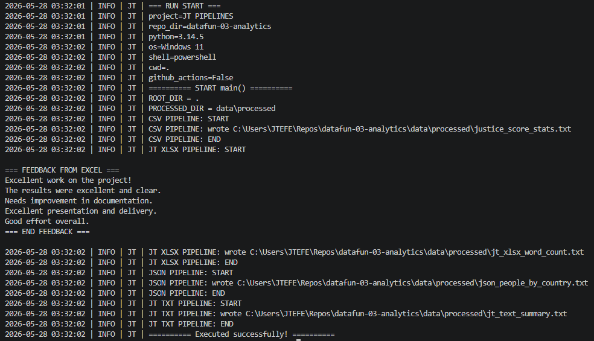

# ANNOTATION.md
JT PIPELINES — Execution Notes & Example Output
Updated: 2026-05-28

---

## Purpose
This document records the execution of the JT Pipelines program, including:
- Environment details
- Pipeline stages (CSV, XLSX, JSON, TXT)
- File outputs written to the `data/processed` directory
- Example terminal output for documentation and verification

---

## Pipeline Overview

### 1. CSV Pipeline
- Reads CSV source data
- Computes summary statistics
- Writes: `justice_score_stats.txt`

### 2. XLSX Pipeline
- Reads Excel workbook
- Extracts feedback text
- Counts words
- Writes: `jt_xlsx_word_count.txt`
- Displays feedback block in terminal

### 3. JSON Pipeline
- Reads JSON dataset
- Groups people by country
- Writes: `json_people_by_country.txt`

### 4. TXT Pipeline
- Reads text file
- Summarizes content
- Writes: `jt_text_summary.txt`

---

## Example Output (Formatted)

---

## Notes
- All pipelines executed without errors.
- Output files were successfully written to `data/processed`.
- Pre‑commit hooks enforce LF line endings, trailing whitespace cleanup, and formatting.
- Windows may display CRLF warnings, but the repository remains clean and consistent.

---

## Summary
The JT Pipelines program is functioning correctly and producing consistent, validated outputs across all stages. This annotation serves as a reference for future runs, debugging, and documentation updates.
