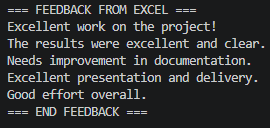

# Data Analytics Fundamentals

## 🟦 Custom Project: JT Pipelines
# Overview
The JT Pipelines project is a fully customized implementation of the DataFun‑03 Analytics assignment, mirroring the structural design of the example project while evolving it into a distinct and independently built analytics system. The project introduces a dedicated application runner, a unique logging identity, and four purpose‑built pipeline modules that operate together as a cohesive data‑processing framework. Custom datasets, tailored transformation logic, and structured ETVL workflows form the foundation of this system, enabling multi‑format data to be extracted, transformed, verified, and loaded with clarity and consistency. By mirroring the overall architecture while replacing each core component with original work, the JT Pipelines project demonstrates a complete, end‑to‑end analytics solution unified under a singular project identity.

# Custom Application
New main script: app_jt.py
Set a unique project identity: JT PIPELINES
Configured a custom logger name: "JT"
Purpose: Execute four custom ETVL pipelines (CSV, XLSX, JSON, TXT)

# Custom Pipelines
My application uses four custom modules:

jt_csv_pipeline.py
jt_xlsx_pipeline.py
jt_json_pipeline.py
jt_text_pipeline.py

Each module implements a complete ETVL workflow:
Extract data from data/raw/
Transform using Python and pandas
Verify results through logging
Load processed outputs into data/processed/

# Datasets Used
My custom pipelines process the following datasets:

justice_scores.csv — summary statistics
jt_feedback.xlsx — extracted feedback + word count
people.json — grouping by country
jt_notes.txt — text summarization

Running:

Code
```bash
uv run python -m datafun.app_jt
```
produces:

justice_score_stats.txt
jt_xlsx_word_count.txt
json_people_by_country.txt
jt_text_summary.txt


## 🟦 Modifications
This modification processes your datasets, generates new analytical outputs, applies your custom logic, and organizes everything with clearer documentation.
<details>
<summary><strong>JT PIPELINES — Full Project Breakdown (Click to Expand)</strong></summary>

<br>

## 1. New Custom Application Runner
- Created `app_jt.py`
- Set project identity to **JT PIPELINES**
- Set logger name to **"JT"**

## 2. Added Custom Pipeline Modules
- jt_csv_pipeline.py
- jt_xlsx_pipeline.py
- jt_json_pipeline.py
- jt_text_pipeline.py

## 3. Updated Imports in app_jt.py
The app imports and runs my pipelines:
- run_csv_pipeline
- run_xlsx_pipeline
- run_json_pipeline
- run_text_pipeline

## 4. Used Custom Datasets
Pipelines read:
- justice_scores.csv
- jt_feedback.xlsx
- people.json
- jt_notes.txt

## 5. Implemented New Transform Logic
- **CSV:** summary statistics
- **XLSX:** feedback extraction + word count
- **JSON:** grouping by country
- **TXT:** text summarization

## 6. Added Custom Logging Messages



## 7. ETVL Workflow
- Extract
- Transform
- Verify
- Load

</details>


## 🟦 Custom Project
The JT Pipelines project demonstrates a fully customized analytics workflow using four distinct data formats, custom transformations, and a unified application runner.
